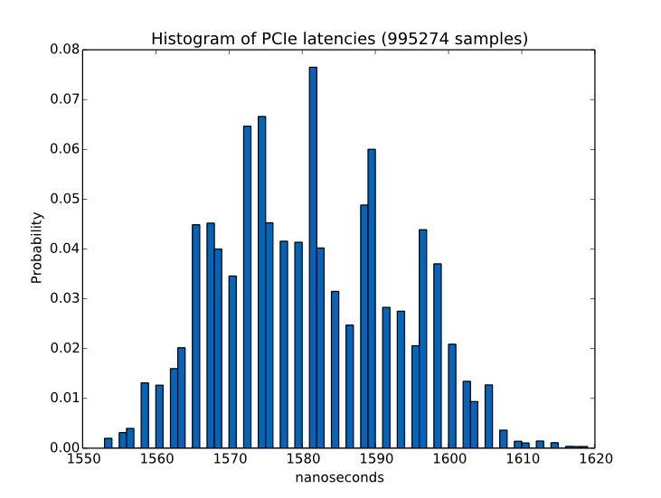

#pcie-lat#

A generic x86_64 PCIe latency measurement module for the Linux Kernel.

PCIe latencies for a device are measured via the execution time (via x86 Time Stamp Counter ticks) of reading a 32 Bit word from a PCIe device (aka round-trip time CPU->PCIe Device->CPU).

Users can specify:
* The Base Address Register (BAR) from which the 32 Bit word is read. (`Default 0`)
* The offset within the BAR. (`Default 0x0`)
* Sample count / Measuremnt Loops (`Default 100_000`)

##Important##

**Disable CPU power-saving features (SpeedStep/TurboBoost) that modify CPU clock in order to minimize result variances**

##Usage##

First of all, become su:

```shell
sudo su
```

If the device you want to measure is currently bound to a driver, release it:

```shell
echo 0000:08:10.0 > /sys/bus/pci/devices/0000\:08\:10.0/driver/unbind
```

In the following, you'll need device and vendor ids of the PCIe device you want to measure. If you don't know them yet, look them up via `lspci`:

```shell
lspci -nn -s 08:10.0

> 08:10.0 Ethernet controller [0200]: Intel Corporation 82576 Virtual Function [8086:10ca] (rev 01)
```

Build the kernel module and insert it. Supply device and vendor ids to insmod via the `ids` argument:

```shell
make
insmod ./pcie-lat.ko ids=8086:10ca
```


If you want to add additional devices later on, you can do so via sysfs:

```shell
echo "10ee 7014"  > /sys/bus/pci/drivers/pcie_lat/new_id 
echo 0000:20:00.0 > /sys/bus/pci/drivers/pcie_lat/bind
```

Execute measurements via the supplied ruby script. Mandatory argument is the PCIe device BDF. Offset, BAR and loop count is optional:

```shell
ruby measure.rb -p 08:10.0 -l 1000000 -b 0 -o 0x0

> TSC freq:     2294470000.0 Hz
> TSC overhead: 52 cycles
> Device:       08:10.0
> BAR:          0
> Offset:       0x0
> Loops:        1000000
>
>        | Results (1000000 samples)
> ------------------------------------------------------
> Mean   |   3628.02 cycles |   1581.20 ns
> Stdd   |     30.69 cycles |     13.37 ns
>
>
>        | 3σ Results (995274 samples, 0.005% discarded)
> ------------------------------------------------------
> Mean   |   3627.52 cycles |   1580.99 ns
> Stdd   |     27.69 cycles |     12.07 ns
>
> writing 3σ values (in ns) to file...
```

##Visualization##

The script saves the 3σ values of the measurement run into a csv file, e.g. `lat_1000000_loops_3sigma.csv`.
You can view them via [NumPy](http://www.numpy.org/)/[matplotlib](http://matplotlib.org/):

```shell
python hist.py lat_1000000_loops_3sigma.csv
```

Example Output:



##Remarks##
* pcie-lat only works on 64 Bit x86 architectures.
* Look at the comments inside the source files for more in-depth explanations.
* Some debug/runtime information can be viewed via `dmesg`.

##Credits##
* Chris Wright: Linux [pci-stub](https://github.com/torvalds/linux/blob/master/drivers/pci/pci-stub.c) driver.
* Gabriele Paoloni: TSC code presented in "[How to Benchmark Code Execution Times on Intel IA-32 and IA-64 Instruction Set Architectures](http://www.intel.com/content/dam/www/public/us/en/documents/white-papers/ia-32-ia-64-benchmark-code-execution-paper.pdf)"

##License##
Copyright (C) 2014 by the author(s)

This program is free software; you can redistribute it and/or modify
it under the terms of the GNU General Public License as published by
the Free Software Foundation; either version 2 of the License, or
(at your option) any later version.

This program is distributed in the hope that it will be useful,
but WITHOUT ANY WARRANTY; without even the implied warranty of
MERCHANTABILITY or FITNESS FOR A PARTICULAR PURPOSE.  See the
GNU General Public License for more details.

You should have received a copy of the GNU General Public License along
with this program; if not, write to the Free Software Foundation, Inc.,
51 Franklin Street, Fifth Floor, Boston, MA 02110-1301 USA.
